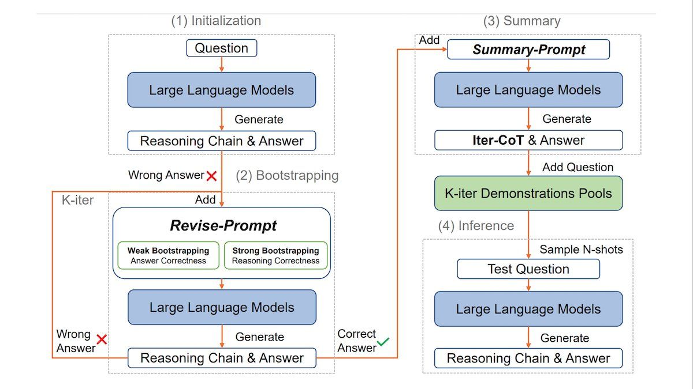

# Multimodal RAG

## Prerequisities
<mark>I recommend running it in virtual environment. You can use any suitable python environment manager</mark>

```bash
python3 -m venv env
source ./env/bin/activate
```

```bash
pip install requirements.txt
```

## Architecture
 <br>
<mark>The problem of the Multimodal RAGs is that the data is not unimodal.
I have come up with the idea to caption images with short descriptions. With that vectorspace becomes unimodal. Other possible approaches include taking embedding model for images such as CLIP and embed the images. In my opinion, my approach seemed inefficient. Why so? I will describe it in Problems section.</mark>

## Data Ingestion
<mark>Data ingestion started with scrapping the data. Almost every other website has `sitemap.xml` file which has listed all endpoint. With that file I parsed all endpoints which include https://www.deeplearning.ai/the-batch/. During scrapping and analyzing webpages structure I came to the conclusion that the most relevant information is in `<p>` paragraphs. It's pretty obvious, since the website is some sort of newsletter.</mark>

## Data preparation
<mark>Preparing the data didn't take much efforts. I just had to parse HTML using BeatifulSoup with one simple function. Images were stored in original size in the dataset. In the database they were stored twice smaller for both memory and computation efficiency. After that with another simple function converted textual data into `Document` datatype storing original modality of data and source.</mark>

## Models
<mark>For the task I used two Vision Language models. [llava-hf/llava-v1.6-mistral-7b-hf](https://huggingface.co/llava-hf/llava-v1.6-mistral-7b-hf) and [Salesforce/blip-image-captioning-large](https://huggingface.co/Salesforce/blip-image-captioning-large). Salesforce model is a small BLIP model which is perfect for image captioning. While Llava model was being used for question answering. As it is big model I loaded quantized version with `bfloat16` tensor type which good choice for computation/quality ratio.</mark>

## Database
<mark>I used Facebook AI Similarity search. There are many of options of Vector DBs. Most of them are pretty similar. Moreover, Langchain has almost identical wrapper for them, including FAISS.</mark>

## Problems

### Computational power
<mark>Since I didn't have access to LLMs API such as Gemini, ChatGPT, Claude... I had to run It locally. I have not that powerful GPU and Laptop, so my decison was to implement everything inside Kaggle Notebooks (Or Google Colab, doesn't really matter). So this problem was partially solved.
</mark>

### Quality of images descriptions
<mark>I'll provide the example for better undestanding. Let's take a photo from Deeplearning.ai's The Batch of Andrew Ng shaking hand with the President os South Korea.  Let's describe the photo with both models.</mark>

```python
small_processor = BlipProcessor.from_pretrained("Salesforce/blip-image-captioning-large")
small_model = BlipForConditionalGeneration.from_pretrained("Salesforce/blip-image-captioning-large", torch_dtype=torch.float16).to(device)

def desc_img(img):
    inputs = small_processor(img, return_tensors="pt").to("cuda", torch.float16)

    out = small_model.generate(**inputs)
    return small_processor.decode(out[0], skip_special_tokens=True)

img = Image.open("/kaggle/working/unnamed--5--1.png")
desc_1 = desc_img(img)
print(desc_1)
>>> two men shaking hands in front of flags and a table
CPU times: user 517 ms, sys: 4 ms, total: 521 ms
Wall time: 319 ms
```

<mark>Now let's use Llava</mark>

```python
bnb_config = BitsAndBytesConfig(
    load_in_4bit=True,
    bnb_4bit_use_double_quant=True,
    bnb_4bit_quant_type="nf4",
    bnb_4bit_compute_dtype=torch.bfloat16
)

device = torch.device('cuda' if torch.cuda.is_available() else 'cpu')
large_processor = LlavaNextProcessor.from_pretrained("llava-hf/llava-v1.6-mistral-7b-hf")
large_model = LlavaNextForConditionalGeneration.from_pretrained(
    "llava-hf/llava-v1.6-mistral-7b-hf",
    quantization_config=bnb_config
)
large_model.to(device)

conversation = [
    {

      "role": "user",
      "content": [
          {"type": "text", "text": "What is shown in this image?"},
          {"type": "image"},
        ],
    },
]
prompt = large_processor.apply_chat_template(conversation, add_generation_prompt=True)
inputs = large_processor(images=img, text=prompt, return_tensors="pt").to("cuda:0")
output = large_model.generate(**inputs, max_new_tokens=100)
print(processor.decode(output[0], skip_special_tokens=True))
>>> [INST]  
What is shown in this image? [/INST] The image shows two men shaking hands. They are dressed in formal attire, with one wearing a dark suit and the other in a light-colored suit. Behind them, there are flags that suggest a diplomatic or official setting, possibly a meeting between two countries or organizations. The text at the bottom of the image provides context, indicating that the meeting is between Andrew Ng (left) and Yoon Suk (right), and it took place on July 30, 202
CPU times: user 54.7 s, sys: 3.28 s, total: 58 s
Wall time: 58 s
```

<mark>As we can see the difference in quality in drastical. But the generation time as well. So that's why in previous section I told computation propblem was partialy solved. Possibly, another way to fix this is to use different RAG architecture with CLIP or similar model for images embeddings. So this problem causes next troubles.</mark>

### Image Retrievals
<mark>Let's take the article where I found the photo from above (https://www.deeplearning.ai/the-batch/issue-265/). What I want to show that small description are bad choice. So I have all documents stored in  FAISS DB. Let's make a query `Who is Andrew Ng?` and look what it's going to retrieve.<mark>

```python
q = "Who is Andrew Ng?"
retrieved = db.similarity_search(q, k=5)
for ctx in retrieved:
    print(ctx.metadata)
>>> {'source': '/kaggle/input/scraped-data/scraped/scraped_text/1194.html', 'type': 'text'}
    {'source': '/kaggle/input/scraped-data/scraped/scraped_text/1386.html', 'type': 'text'}
    {'source': '/kaggle/input/scraped-data/scraped/scraped_text/1208.html', 'type': 'text'}
    {'source': '/kaggle/input/scraped-data/scraped/scraped_text/346.html', 'type': 'text'}
    {'source': '/kaggle/input/scraped-data/scraped/scraped_text/286.html', 'type': 'text'}
```

<mark>As we can see everything it has retrieved is text. It pretty obvious that DB didn't retrieve any photos with Andrew Ng. Most likely, DB stores really generalized description of photo. Here's example when Db retrives some photos.</mark>

```python
q = "Graph with Large Language Models"
retrieved = db.similarity_search(q, k=5)
for ctx in retrieved:
    print(ctx.metadata)

>>> {'source': '/kaggle/input/scraped-data/scraped/scraped_text/1693.html', 'type': 'text'}
    {'source': '/kaggle/input/scraped-data/scraped/scraped_text/621.html', 'type': 'text'}
    {'source': '/kaggle/input/scraped-data/scraped/scraped_text/42.html', 'type': 'text'}
    {'source': '/kaggle/input/scraped-data/scraped/scraped_text/1120.html', 'type': 'text'}
    {'source': '/kaggle/input/scraped-data/scraped/scraped_images/1374.jpg', 'type': 'image'}
```
<mark>Here we have one image retrieved:</mark>

<mark>Let's check what's the description</mark>

```python
desc_1 = desc_img(img)
print(desc_1)
>>> a diagram of a language model for a language language
```
<mark>So, yes it generated `language model` sequence. That's why it was retrieved</mark>

## Links

[Kaggle Notebook](https://www.kaggle.com/code/hamuladm/multimodal-rag) <br>
[Dataset](https://www.kaggle.com/datasets/hamuladm/scraped-data)

